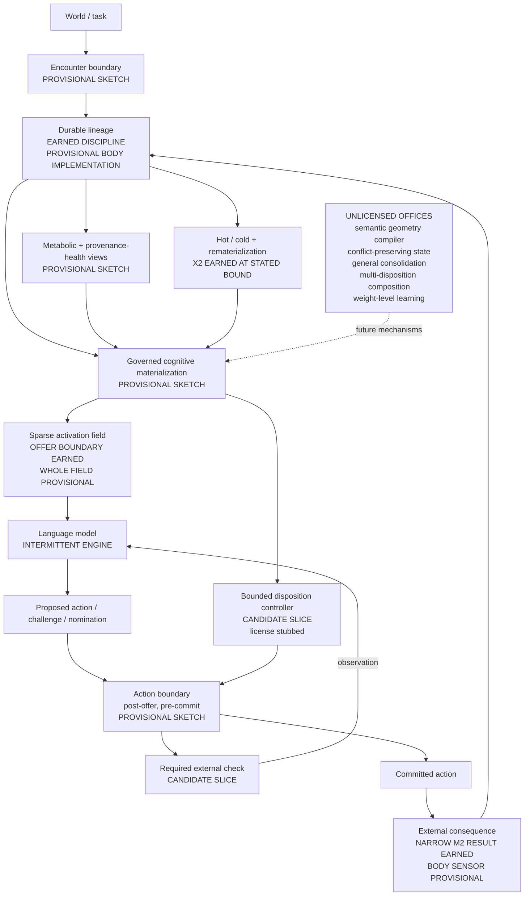

# NEXT substrate orientation map

Status: **living orientation map**. Updated 2026-07-19 after the EFC v2
admission-band close and the Body-0 v0.2 `not_engaged` close; previously updated
2026-07-16 after the EFC v1 calibration close.

Purpose: answer "what are we building?" without letting a diagram promote
proposed anatomy into findings. The architecture lives in
[NEXT_SUBSTRATE.md](NEXT_SUBSTRATE.md); the executable sketch lives in
[sketches/next_substrate/](../sketches/next_substrate/README.md).

## Maturity legend

| Label | Meaning |
| --- | --- |
| **Earned** | Closed, scored evidence at a stated bound; follow the linked finding |
| **Provisional sketch** | Executable composition or interface with authored behavior; wire evidence only |
| **Candidate slice** | The next mechanism shape to license or falsify; not built as an experiment |
| **Unlicensed office** | Wanted direction without a consumer, oracle, or loss sufficient for build |

## The body at a glance



The arrows describe intended information and control flow. They do not assert
that every node exists as a product component. Read the labels before the nouns.

## Maturity register

| Body concern | Current state | Evidence or artifact | Honest boundary |
| --- | --- | --- | --- |
| Append-only lineage | **Earned discipline**; **provisional body implementation** | Harness ledgers across the lab; walking skeleton JSONL | The sketch's event shapes are not product schema |
| Governed offer boundary | **Earned** | M-track specs, rubric, and findings through M3 | Governs present influence; not the whole body |
| Failure affecting a later session | **Earned narrowly** | [M2 findings](M2_FINDINGS.md) | One-hop earned record, not cross-domain disposition transfer |
| Earned vs asserted trust | **Earned narrowly** | [M3 findings](M3_FINDINGS.md) | Does not solve write-time significance generally |
| Hot/cold eviction and recovery | **Earned narrowly** | [X2 findings](X2_FINDINGS.md) | One sequence/corpus shape; no general sleep subsystem |
| Governed materialization | **Provisional sketch** | [walking skeleton](../sketches/next_substrate/README.md) | Deterministic replay demonstrates composition only |
| Sparse activation plus action boundary | **Provisional sketch** | Walking skeleton controller rows | No real engine or licensed controller treatment |
| Structural failure disposition | **Parked candidate; three typed refusals** | [v0](EFC_V0_FINDINGS.md), [v1](EFC_V1_FINDINGS.md), and [v2](EFC_V2_FINDINGS.md) findings; `epistemic_frame_check_v0_stub` in the sketch | v0's free-text oracle failed cold review; v1 found a menu ceiling; v2 found within-class chance behavior and constant policy. The mechanism remains unearned and reopens only on its sealed admission trigger |
| Earned-property composition | **Closed `not_engaged`; integration unearned** | [Body-0 findings](BODY_0_FINDINGS.md) | R/C failed recurrence while A/X answered without the earned path. Machinery held, but causal need was absent |
| Metabolic proprioception | **Provisional sketch** | Check-cost and wire-causal events | No real carry-cost or benefit finding |
| Provenance-health retirement | **Provisional sketch** | External warrant-revision sweep | Demonstrates dependency flow, not correctness |
| Semantic failure geometry | **Unlicensed office** | Architecture only | Would introduce another classifier requiring its own license |
| Conflict-preserving cognitive state | **Unlicensed office** | Architecture only | No representation or consumer has earned build |
| General consolidation | **Unlicensed office** | Architecture only | v0 disposition activation is the only candidate transform |
| Multiple interacting dispositions | **Unlicensed office** | Architecture only | Current candidate license is one active disposition (`n=1`) |
| Weight-level learning | **Outside substrate scope** | Open wound in the architecture | The body changes expression and policy, not model weights |

## What the executable sketch establishes

- One event can traverse encounter, lineage, materialization, activation,
  action-boundary control, model action, consequence, metabolic accounting, and
  provenance revision.
- Materialized state can be rebuilt from disk between invocations.
- A non-matching task can remain silent.
- An external warrant revision can suspend dependent state without model appeal.

It does **not** establish language-model learning, transfer, mechanism value, or
scientific superiority. Its deterministic behavior is authored.

## Current candidate work

No new scientific mechanism is licensed. The epistemic-frame candidate remains
parked after three typed refusals:

```text
world-checked failure
  -> bounded structural disposition
  -> required external check on a different-domain matching task
  -> improved outcome at priced control cost
  -> no tax on non-matching tasks
```

The lineage moved from v0's failed free-text oracle, through v1's live
wire-commitment surface and menu ceiling, to v2's sealed counterfactual battery.
Two small-engine families passed ordinary competence but failed sideways:
constant policy and chance-level within-class choice. The successor admission
requirement is now executable and sealed: an untreated engine must land inside
the declared band with all competence and anti-constant guards passing before a
treatment leg may run. Candidate engines may be smoke-tested against that gate;
the instrument is not redesigned around misses.

[Body-0](BODY_0_COMPOSITION_AUDIT.md) then tested whether the already-earned M2
consequence path, M3 authority boundary, and X2 hot/cold recovery preserve their
narrow properties when composed in one persistent loop. Its real run closed
`not_engaged`: R/C missed the recurrence while A/X answered correctly without
the earned path. The protected projection and replayed cost machinery held, but
the composition edge remains provisional because no causal integration result
was earned. See [findings](BODY_0_FINDINGS.md).

## Update contract

Update this map when—and only when—one of these happens:

1. a computed finding changes an **Earned** boundary;
2. the embodiment sketch gains or loses an executable connection;
3. a mechanism passes its admission gate and becomes an active build;
4. a proposed office gains a concrete consumer, oracle, and loses-condition;
5. evidence retires or narrows a previously earned claim.

Thread convergence alone does not promote a node. A stub does not become earned
because it makes a compelling demonstration.
