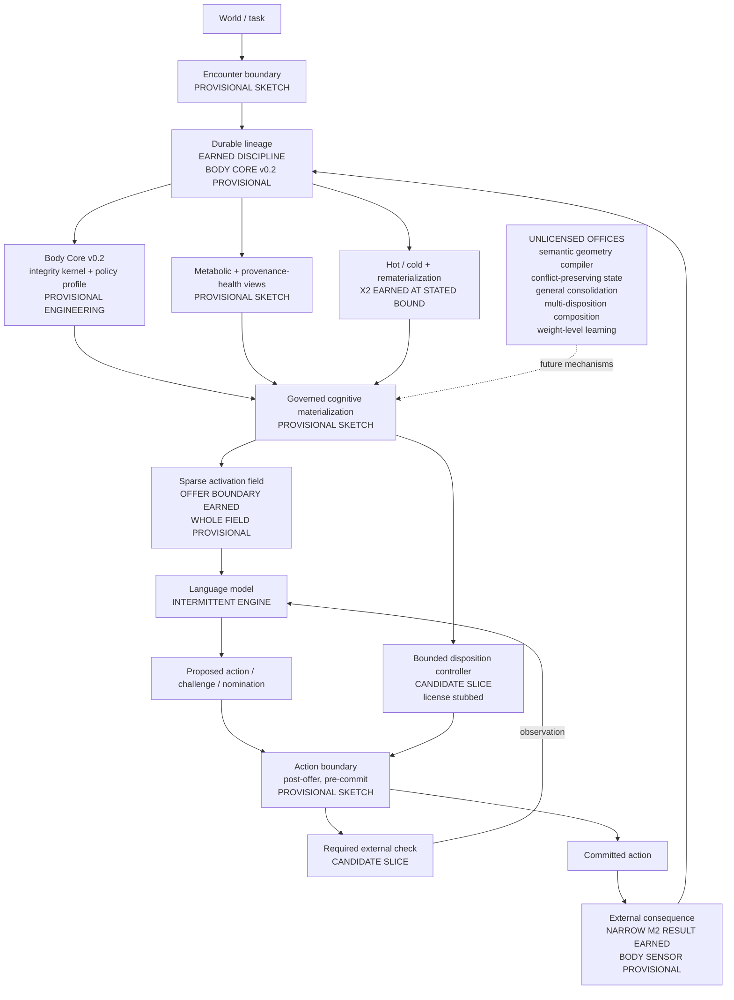

# NEXT substrate orientation map

Status: **living orientation map**. Updated 2026-07-21 for provisional Body Core
v0.2 engineering and its X2 and M2 adapters after active frontier search paused;
previously updated after the terminal frontier-obligation, Body-1, EFC v2, and
Body-0 closes.

Purpose: answer "what are we building?" without letting a diagram promote
proposed anatomy into findings. The architecture lives in
[NEXT_SUBSTRATE.md](NEXT_SUBSTRATE.md); the executable sketch lives in
[sketches/next_substrate/](../sketches/next_substrate/README.md).

## Maturity legend

| Label | Meaning |
| --- | --- |
| **Earned** | Closed, scored evidence at a stated bound; follow the linked finding |
| **Provisional sketch** | Executable composition or interface with authored behavior; wire evidence only |
| **Candidate slice** | The next mechanism shape to license or falsify; not built as an experiment |
| **Unlicensed office** | Wanted direction without a consumer, oracle, or loss sufficient for build |

## The body at a glance



The arrows describe intended information and control flow. They do not assert
that every node exists as a product component. Read the labels before the nouns.

## Maturity register

| Body concern | Current state | Evidence or artifact | Honest boundary |
| --- | --- | --- | --- |
| Integrity kernel | **Earned discipline**; **Body Core v0.2 provisional implementation** | Harness ledgers across the lab; [Body Core](../sketches/next_substrate/core.py) JSONL | Ordering, hash linkage, declared authority, references, scopes, retention shapes, and replay-over-cache; not cryptographic writer authentication or product schema |
| Provisional policy profile | **Provisional engineering** | Body Core v0.2; `make body-core-test` | Lifecycle, binary hot/cold, warrant vocabulary, and invalid-warrant suspension are policy choices under test, not neutral ontology |
| X2-to-Core adapter | **v0.2 cold-reviewed; endorsed** | [adapter contract](BODY_CORE_X2_ADAPTER.md), [v0.1 review](BODY_CORE_X2_REVIEW.md), [v0.2 review](BODY_CORE_M2_REVIEW.md); `make body-core-x2-test` | Four closed ledgers round-trip through the unchanged scorer; v0.2 closes arbitrary placement-event correspondence; wire preservation only |
| M2-to-Core adapter | **Cold-reviewed; endorsed after one repair** | [adapter contract](BODY_CORE_M2_ADAPTER.md), [review](BODY_CORE_M2_REVIEW.md); `make body-core-m2-test` | Ten closed S1/S2 pairs reverse-project with digest equality; exercises world-failure warrants and session-seam lifecycle; no new M2 evidence |
| Governed offer boundary | **Earned** | M-track specs, rubric, and findings through M3 | Governs present influence; not the whole body |
| Failure affecting a later session | **Earned narrowly** | [M2 findings](M2_FINDINGS.md) | One-hop earned record, not cross-domain disposition transfer |
| Earned vs asserted trust | **Earned narrowly** | [M3 findings](M3_FINDINGS.md) | Does not solve write-time significance generally |
| Hot/cold eviction and recovery | **Earned narrowly** | [X2 findings](X2_FINDINGS.md) | One sequence/corpus shape; no general sleep subsystem |
| Governed materialization | **Provisional sketch** | [walking skeleton](../sketches/next_substrate/README.md) | Deterministic replay demonstrates composition only |
| Sparse activation plus action boundary | **Provisional sketch** | Walking skeleton controller rows | No real engine or licensed controller treatment |
| Structural failure disposition | **Parked candidate; three typed refusals** | [v0](EFC_V0_FINDINGS.md), [v1](EFC_V1_FINDINGS.md), and [v2](EFC_V2_FINDINGS.md) findings; `epistemic_frame_check_v0_stub` in the sketch | v0's free-text oracle failed cold review; v1 found a menu ceiling; v2 found within-class chance behavior and constant policy. The mechanism remains unearned and reopens only on its sealed admission trigger |
| Earned-property composition | **Closed `not_engaged`; integration unearned** | [Body-0 findings](BODY_0_FINDINGS.md) | R/C failed recurrence while A/X answered without the earned path. Machinery held, but causal need was absent |
| Consequence-bound obligation at a changing-world action boundary | **Parked candidate; admission lineage closed** | [frontier candidate](FRONTIER_OBLIGATION_CANDIDATE.md), [admission findings](FRONTIER_OBLIGATION_ADMISSION_FINDINGS.md) | Terminal candidate returned 8/12 exact commitments; four bare `WAIT` values failed the frozen action-label wire. No treatment was built and the conjecture remains untested |
| Metabolic proprioception | **Provisional sketch** | Check-cost and wire-causal events | No real carry-cost or benefit finding |
| Provenance-health retirement | **Provisional sketch** | External warrant-revision sweep | Demonstrates dependency flow, not correctness |
| Semantic failure geometry | **Unlicensed office** | Architecture only | Would introduce another classifier requiring its own license |
| Conflict-preserving cognitive state | **Unlicensed office** | Architecture only | No representation or consumer has earned build |
| General consolidation | **Unlicensed office** | Architecture only | v0 disposition activation is the only candidate transform |
| Multiple interacting dispositions | **Unlicensed office** | Architecture only | Current candidate license is one active disposition (`n=1`) |
| Weight-level learning | **Outside substrate scope** | Open wound in the architecture | The body changes expression and policy, not model weights |

## What the executable sketch establishes

- One event can traverse encounter, lineage, materialization, activation,
  action-boundary control, model action, consequence, metabolic accounting, and
  provenance revision.
- Materialized state can be rebuilt from disk between invocations.
- Body Core v0.2 can independently verify its envelope and view claims, then
  rebuild state, warrant health and dependencies, placement, and metabolic
  reports.
- A non-matching task can remain silent.
- An external warrant revision can suspend dependent state without model appeal.

It does **not** establish language-model learning, transfer, mechanism value, or
scientific superiority. Its deterministic behavior is authored.

## Current work

The active build is **Body Core v0.2** engineering: an integrity kernel and an
explicitly provisional lifecycle/placement/warrant policy profile. X2 pressures
placement correspondence; M2 pressures world-failure warrants and session-seam
lifecycle. Both require unchanged scorers to reproduce closed results. This is
allowed under the frontier pause because it has independent integration value
for every future body slice. It remains provisional and wire/integration-only.
It does not promote a candidate mechanism, reduce the cost of full replay, or
change an earned boundary.

The M2 review's prerequisite before a third adapter is now implemented and
[cold-endorsed](BODY_CORE_SOURCE_BINDING_REVIEW.md): a Core-adjacent
[source-binding helper](BODY_CORE_SOURCE_BINDING.md) validates selected
post-admission receipts without granting client policy authority. X2 and M2
retain their distinct correspondence and refusal rules. The endorsement
licenses a third-adapter proposal only, not implementation.

The exact-source-indexed [M3 adapter proposal](BODY_CORE_M3_ADAPTER_PROPOSAL.md)
and [v0.1 implementation](BODY_CORE_M3_ADAPTER.md) are cold-endorsed without
repair. The adapter reversibly carries M3 boundary decisions while keeping
asserted trust as payload rather than Core authority. Fourteen
refusal/preservation probes pass; the [review record](BODY_CORE_M3_ADAPTER_REVIEW.md)
keeps the transport-topology and test-strength debts visible. There is no new
M3 evidence.

## Parked candidate work

No new scientific mechanism is licensed. Active frontier search is
[paused](FRONTIER_PAUSE.md). Unplanned observations from other work go to the
[passive anomaly log](ANOMALY_LOG.md) and are reviewed monthly or after three
materially similar entries. Log capture does not promote a candidate slice or
change any maturity label in this map.

The epistemic-frame candidate remains parked after three typed refusals:

```text
world-checked failure
  -> bounded structural disposition
  -> required external check on a different-domain matching task
  -> improved outcome at priced control cost
  -> no tax on non-matching tasks
```

The lineage moved from v0's failed free-text oracle, through v1's live
wire-commitment surface and menu ceiling, to v2's sealed counterfactual battery.
Two small-engine families passed ordinary competence but failed sideways:
constant policy and chance-level within-class choice. The successor admission
requirement is now executable and sealed: an untreated engine must land inside
the declared band with all competence and anti-constant guards passing before a
treatment leg may run. Candidate engines may be smoke-tested against that gate;
the instrument is not redesigned around misses.

[Body-0](BODY_0_COMPOSITION_AUDIT.md) then tested whether the already-earned M2
consequence path, M3 authority boundary, and X2 hot/cold recovery preserve their
narrow properties when composed in one persistent loop. Its real run closed
`not_engaged`: R/C missed the recurrence while A/X answered correctly without
the earned path. The protected projection and replayed cost machinery held, but
the composition edge remains provisional because no causal integration result
was earned. See [findings](BODY_0_FINDINGS.md).

The next frontier pass nominated one exact consequence-bound obligation whose
status may change after the ordinary offer snapshot and before commitment. Its
first cold review blocked the missing placement comparator. The bounded repair
added an offer-only lane with the same snapshot, bidirectional post-offer world
changes, and stable-world cost losses; a fresh final review endorsed that
concept. Its exact-hash-endorsed
[admission proposal](FRONTIER_OBLIGATION_ADMISSION_PROPOSAL.md) produced a
reviewed packet, runner, checker, and one terminal candidate pin. The twelve
admission calls completed, but four bare `WAIT` values failed the exact
artifact-qualified action wire. The checker closed
`admission_refused(commitment_invalid)`. No retry, replacement candidate, or
treatment is licensed. See the
[candidate note](FRONTIER_OBLIGATION_CANDIDATE.md) and
[admission findings](FRONTIER_OBLIGATION_ADMISSION_FINDINGS.md).

## Update contract

Update this map when—and only when—one of these happens:

1. a computed finding changes an **Earned** boundary;
2. the embodiment sketch gains or loses an executable connection;
3. a mechanism passes its admission gate and becomes an active build;
4. a proposed office gains a concrete consumer, oracle, and loses-condition;
5. evidence retires or narrows a previously earned claim.

Thread convergence alone does not promote a node. A stub does not become earned
because it makes a compelling demonstration.
