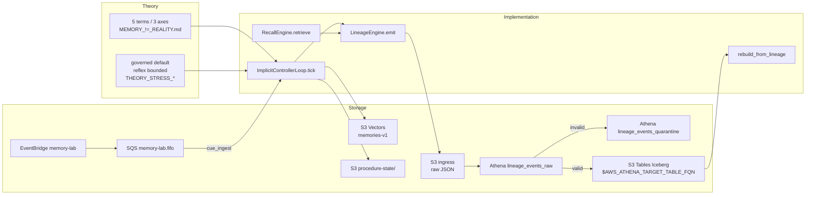

# Agent Primer

Status: Required reading
Audience: any agent (human or AI) about to touch this repo

## 1) Why this file exists

Load this before anything else. If you read this file plus `AGENTS.md`, you can do useful work in this repo without first reading eight others. Everything else becomes "open only when the task asks for it."

The repo is small. The conventions are important. Drift in conventions is the failure mode this primer is designed to prevent.

## 2) Mission

From `AGENTS.md`:

> Build and maintain a small AWS-native memory lab where:
>
> - cognitive memory can mutate
> - lineage is immutable, append-only, and replayable

In one line: behavior is a moving target, history is not.

## 3) Read order

Read in this order. Stop here unless the task pulls you deeper.

1. `specs/AGENT_PRIMER.md` (this file)
2. `AGENTS.md` — rules for coding agents
3. `notes/MEMORY_!=_REALITY.md` — vocabulary
4. `notes/THEORY_STRESS_AND_IMPLICIT_MEMORY.md` — operating posture
5. `specs/IMPLICIT_MEMORY_SPEC.md` — governed/reflex contract

Deeper specs and notes are listed in § 14 and should only be loaded when the task actually needs them.

## 4) Vocabulary to keep separate

The whole project rests on not collapsing these terms.

Five things this system distinguishes:

- **belief** — current internal acceptance level of a claim
- **claim** — proposition asserted by a source
- **memory** — stored trace plus its metadata
- **evidence** — externally anchored support for a claim
- **reality** — observer-independent ground truth

Collapsing `memory` into `reality` is how hallucination, confabulation, propaganda, and historical revisionism emerge. The system holds them apart on purpose.

Three uncertainty axes, not one:

- **confidence_in_claim** — how sure are you of the proposition
- **confidence_in_recall_process** — how sure are you the reconstruction is intact
- **confidence_in_provenance_chain** — how sure are you the path from original source to here is intact

Source: `notes/MEMORY_!=_REALITY.md`. Treat trust as a prior, not truth.

## 5) System shape




## 6) Storage map

Concrete names. No prose.

- **S3 Tables Iceberg** — canonical lineage, append-only, source of truth. Table name resolved at runtime from `AWS_ATHENA_TARGET_TABLE_FQN` in `.env`; current `schema_version` lives in `src/types.py::EVENT_SCHEMA_VERSION`. Do not write the version literal here (see `AGENTS.md` § Documentation conventions).
- **S3 Vectors** — index `memories-v1`, 1536-dim, cosine. Rebuildable recall index. Not source of truth.
- **S3 ingress bucket** — raw JSON event files, partitioned `agent_id=.../stream_id=.../event_date=.../<event_time>_<event_id>.json`.
- **Athena `lineage_events_raw`** — validatable intake over the ingress prefix.
- **Athena `lineage_events_quarantine`** — invalid rows with a deterministic `reason`.
- **Canonical INSERT** — `INSERT INTO $AWS_ATHENA_TARGET_TABLE_FQN` from raw rows that pass validation.
- **EventBridge `memory-lab` bus + SQS `memory-lab.fifo` + DLQ** — control-plane cues. Wired into the implicit loop per `specs/CONTROL_PLANE_INGEST.md`: `ControlCueRoutingRule` routes the bus to the queue, `src/implicit_memory/cue_ingest.py` captures cues, `run_cue_ingest.py` is the consumer command.
- **S3 `procedure-state/`** — mutable cognitive state (procedure strength, trust, urgency streak). Kept separate from lineage on purpose.

Defined in `stacks/memory_lab/memory_lab_stack.py`. Full inventory in `stacks/README.md`.

## 7) Implementation map

Concrete entry points an agent is likely to touch:

- **Event envelope** — `src/types.py` (`MemoryEvent`, `new_event`; current schema version pinned in `EVENT_SCHEMA_VERSION`)
- **Record/assertion taxonomy (v7)** — `src/epistemic_triangle/` (mapping table, validation, decision-event subject linkage; implements `specs/EPISTEMIC_TRIANGLE.md`)
- **TAI capture + `physical_moment`** — `src/heliotime/` (wall-clock TAI capture at the edge) and `src/timekeeping/` (deterministic `physical_moment` construction, `time_context_declared`, HLC; implements `specs/TAI_TIMEKEEPING.md`)
- **Lineage emit** — `src/lineage_engine.py` (`LineageEngine.emit`)
- **Storage write** — `src/storage.py` (`LineageStorage.append_event`) writes JSON to S3 ingress; canonical inserts happen later via Athena ingestion
- **Athena ingestion** — `src/ingestion/athena_ingestion.py` (`AthenaLineageIngestionJob.run_once`)
- **Canonical reader** — `src/lineage_reader.py` (`AthenaCanonicalReader`, `S3TablesCanonicalReader`)
- **Explicit recall** — `src/explicit_memory/recall.py` (`RecallEngine.retrieve`)
- **Explicit eligibility / conflict** — `src/explicit_memory/eligibility.py`, `src/explicit_memory/conflict.py`
- **Implicit loop** — `src/implicit_memory/loop.py` (`ImplicitControllerLoop.tick`)
- **Implicit trigger policy** — `src/implicit_memory/trigger_policy.py` (`evaluate_trigger`)
- **Implicit admission / eligibility gate** — `src/implicit_memory/admission.py`, `src/implicit_memory/eligibility.py`
- **Reflex bounds** — `src/implicit_memory/reflex_mode.py` (`ReflexController`)
- **Contamination / split-reality** — `src/implicit_memory/contamination.py`
- **Reason taxonomy** — `src/implicit_memory/reasons.py` (`ImplicitReason`)
- **Policy mutation** — `src/implicit_memory/policy_mutation.py`
- **Procedure lifecycle** — `src/implicit_memory/procedure_lifecycle.py`, `src/implicit_memory/procedure_state_store.py`
- **Replay / determinism** — `src/implicit_memory/replay.py` (`rebuild_from_lineage`, `ReplayCueProvider`)
- **Control-plane cue ingestion** — `src/implicit_memory/cue_ingest.py` (`CueIngestionConsumer`, capture-before-act) and `src/implicit_memory/run_cue_ingest.py` (the consumer command); implements `specs/CONTROL_PLANE_INGEST.md`
- **Runtime calibration + consequence-loop bindings** — `src/experiments/implicit/im_w_runtime_calibration.py` produces the live-wire calibration artifact and carries the first two summary-to-summary consequence bindings (`adversarial_matrix_coverage_required`, `dominant_axis_distribution_diversity_required`); `src/experiments/implicit/im_w_consequence_verify.py` is the focused verifier. Implements `specs/RUNTIME_CALIBRATION.md` and `specs/CONSEQUENCE_LOOPS.md` §9 first-implemented slice.
- **Experiments** — `src/experiments/` (`e1..e12` explicit; `implicit/im_a..im_w` + `im_regression` implicit)

## 8) Required event envelope

From `AGENTS.md`, every event must include:

- `event_id`, `event_type`, `agent_id`, `stream_id`, `memory_id`
- `physical_moment` (Tier 1a non-nullable: `tai_iso`, `solar_age_myr`, `ecliptic_lon_deg`, `sequence_in_stream`, `hlc_timestamp`, `time_context_id`; Tier 1b/Tier 2 per `specs/TAI_TIMEKEEPING.md` §5)
- `schema_version` (defined in `src/types.py::EVENT_SCHEMA_VERSION`), `payload`
- `actor_class`, `source_class`
- `parent_event_id` (nullable)
- `record_kind` (closed enum: `lineage_meta | memory_event | decision_event | observation_event | policy_event`)
- `assertion_kind` (required when `record_kind ∈ {memory_event, observation_event}`; closed enum: `belief | claim | memory | evidence | reality_observation`)
- Decision events that carry an `uncertainty_triple` payload also carry `subject_event_id` / `subject_record_kind` / `subject_assertion_kind` (per `specs/EPISTEMIC_TRIANGLE.md` §3.3)

The legacy `event_time` envelope field is removed. The physical-time anchor is `physical_moment.tai_iso`; ingestion quarantines any event that still carries `event_time` (`legacy_event_time_present`). Enforced by `LineageStorage._validate_event` before the JSON is written to ingress; missing fields raise `ValueError`.

## 9) Eligibility math (current state)

The scoring function in use today (`src/explicit_memory/eligibility.py` lines 4-14):

```python
def score_candidate(
    *,
    relevance: float,
    trust: float,
    recency: float,
    reinforcement: float,
    consistency: float,
    safety: float,
) -> float:
    return relevance * trust * recency * reinforcement * consistency * safety
```

Reused by the implicit gate in `src/implicit_memory/eligibility.py`.

Three-axis uncertainty is now specified in `specs/THREE_AXIS_UNCERTAINTY.md`.
Treat that spec as the canonical direction for moving from a scalar score to axis-aware uncertainty representation and gating.

## 10) Two execution modes

From `AGENTS.md`:

> - Governed mode (default): full eligibility/policy checks before influence.
> - Reflex mode (bounded): low-latency path with strict action/time budget, cooldown, and forced re-entry to governed mode.

Reflex entry condition (default): `urgency * risk_signal * sensory_confidence >= reflex_threshold`. See `evaluate_trigger` in `src/implicit_memory/trigger_policy.py`.

Reflex enforcement: `ReflexController` in `src/implicit_memory/reflex_mode.py` tracks `max_actions`, `cooldown_steps`, and forces `exit()` after the budget is spent.

Self-hardening: when attack signals are detected, the loop emits `policy_threshold_updated` / `policy_procedure_superseded` events via `_mutate_policy_from_attack` in `src/implicit_memory/loop.py`. Thresholds in the running policy state move, the lineage records the move, prior events stay intact.

## 11) Non-negotiable invariants

From `AGENTS.md`:

1. Memory behavior can change; lineage history must not be rewritten.
2. S3 Tables is canonical lineage. The active table is named by `AWS_ATHENA_TARGET_TABLE_FQN` in `.env`; the current `schema_version` lives in `src/types.py::EVENT_SCHEMA_VERSION`. Earlier-epoch tables are historical containers; no new writes.
3. S3 Vectors is a rebuildable recall index, not source of truth.
4. Do not auto-resolve contradictions.
5. No current wall-clock influence on replay outputs. Replay-deterministic fields derive from lineage-visible inputs (`physical_moment.tai_iso`, `sequence_in_stream`, HLC step, declared time context). Wall-clock reads happen only at capture in `heliotime.now()`.
6. No silent epistemic collapse. The five-term taxonomy (`belief / claim / memory / evidence / reality_observation`) is enforced at the schema edge via `record_kind` + `assertion_kind` per `specs/EPISTEMIC_TRIANGLE.md`.

Additional, from `specs/IMPLICIT_MEMORY_SPEC.md`:

1. No implicit decision is silent: every trigger evaluation emits an event.
2. Reflex mode is bounded and cannot run indefinitely.

The "every trigger evaluation" clause includes `defer` and `no_op` — see `specs/IMPLICIT_MEMORY_SPEC.md` section 7.2.

## 12) What not to do

- Do not rewrite, delete, or amend past events. Emit a new one.
- Do not auto-resolve contradictions. Persist conflicts as state.
- Do not treat S3 Vectors as source of truth. It is rebuildable from canonical lineage.
- Do not run reflex mode without `max_actions`, `cooldown_steps`, and forced re-entry.
- Do not leak `agent_id` / `stream_id` across scope in retrieval. Cross-scope hits must emit `rejected` with `CROSS_SCOPE_REFERENCE_ATTEMPT`.
- Do not emit decisions silently. Every trigger evaluation, defer, or no-op produces an event.
- Do not bypass `LineageEngine.emit` for writes. Bypassing it skips schema validation.
- Do not use non-ASCII in AWS CDK string edits (per `AGENTS.md`).

## 13) Running things

From repo root, with AWS profile `stack-research`. Prefer Makefile targets when one exists.

- Synth / diff / deploy infra:
`make synth`, `make diff`, `make deploy`
- Athena ingestion (raw -> canonical):
`make ingest` (and `make ingest-preflight` to check schema)
- Implicit regression suite:
`make implicit-regression`
- Single explicit experiment (`e1..e12`):
`make exp-e1` (replace number as needed)
- Runtime calibration (live AWS wire; opt-in via `IMPLICIT_CALIBRATION_RUN=1`):
`make im-w` (representative `full` profile) or `make im-w-loop-probe` (smaller, faster consequence-loop instrument)

Anything not in the Makefile uses the raw form:

- Single implicit loop tick:
`PYTHONPATH=. uv run --project stacks python -m src.implicit_memory.run_loop`
- Any experiment by name:
`PYTHONPATH=. uv run --project stacks python -m src.run_experiment <name>`

Names accepted by `src.run_experiment`: `e1..e12`, `im-a..im-w`, `im-aws`, `im-regression`.

## 14) Deep dives (open only when needed)

- `specs/IMPLICIT_MEMORY_SPEC.md` — touching trigger, admission, eligibility, reflex, contamination, or policy mutation logic.
- `specs/CONTROL_PLANE_INGEST.md` — touching control-plane cue ingestion: the EventBridge → SQS → consumer path, the cue schema, or capture-before-act.
- `specs/EPISTEMIC_TRIANGLE.md` — touching `record_kind` / `assertion_kind`, the five-term taxonomy, decision-event subject classification, evidence links, or the v7 canonical schema.
- `specs/THREE_AXIS_UNCERTAINTY.md` — touching uncertainty representation, eligibility scoring, provenance confidence, or axis-aware gating.
- `specs/PROVENANCE_SIGNAL_WRITER.md` — touching provenance signal production, vector metadata, replay determinism for provenance, or provenance-aware gate inputs.
- `specs/TAI_TIMEKEEPING.md` — touching event time, replay timestamps, canonical lineage schema versions, boundary UTC/Gregorian conversion, or time-context quarantine.
- `specs/RUNTIME_CALIBRATION.md` — touching the `im_w` live-wire calibration run, its workload profiles (`full`, `loop_probe`), Run Summary shape, fixture disclosures, or the calibration pass/fail criteria.
- `specs/CONSEQUENCE_LOOPS.md` — touching outcome feedback, failure memory, attention priors, schema memory, absence memory, counterfactual audit, or run-to-run learning from consequences. §9 carries the first-implemented slice (two summary-to-summary bindings on `im_w`); the rest of the spec is still concept-shape.
- `specs/IMPLICIT_MEMORY_TEST_SPEC.md` — writing or changing an `im_*` experiment.
- `specs/ENGINEERING_SPEC.md` — touching ingestion or Athena.
- `specs/EXPERIMENTS.md` — adding a new experiment file.
- `stacks/README.md` — touching CDK infra.
- `notes/canonical-table-migration-notes.md` — changing the canonical Iceberg schema.
- `notes/IAM_HARDENING_PLAN.md`, `notes/IAM_IMPLEMENTATION_CHECKLIST.md` — touching IAM scope.
- `notes/SYSTEMATIZATION_PLAN_V1.md` — historical roadmap context.
- `notes/AUDITABILITY.md` — extending lineage audit guarantees.
- `notes/agent-pov/` — primary-source agent-as-audience observations and proposals. Read when picking up an agent-originated proposal or before contributing one. Start at `notes/agent-pov/INDEX.md`.

## 15) Known open edges (honest list)

The system knows these are not yet done. They are candidates for the next plan, not silent defects.

- **Envelope `payload` is free-form.** `claim`, `evidence`, `belief`, `memory` are enforced by convention, not by schema. A future loop could quietly conflate them. Cue `payload` shape is also free-form — see the control-plane edge below.
- **Provenance signal production is specified, but the `im_w` calibration runs it under a fixture.** `src/explicit_memory/provenance.py` and the `provenance_resolver.py` shape match `specs/PROVENANCE_SIGNAL_WRITER.md`, but `im_w` uses `StaticProvenanceResolver`, which pins provenance `signal_source` to `computed` and predetermines the provenance axis. Disclosed in the Run Summary `fixture_disclosures` block; flagged on `2026-05-22-review-runtime-calibration-implementation`. Treat `confidence_in_provenance_chain` numbers from `im_w` as fixture-influenced until the resolver runs over real lineage in the loop path.
- **Control plane — wired, with residuals.** The EventBridge → SQS → consumer path is implemented per `specs/CONTROL_PLANE_INGEST.md` and is now being used by the consequence-loop machinery (see next bullet). Residual edges: per-`(agent,stream)` SQS `MessageGroupId` wants an EventBridge Pipe; the production compute form is a Lambda (the lab stops at the command); cue `payload` schema is still free-form; `CalibrationSeenCueStore` in `im_w` uses a run-local front cache because canonical lineage lags S3 ingress within a single fast run, so the `im_w` duplicate probe measures consumer idempotency rather than canonical-lineage-backed dedup (disclosed in the Run Summary).
- **TAI timekeeping is live; some surfaces still maturing.** Canonical lineage carries the `physical_moment` block (`tai_iso`, `solar_age_myr`, `ecliptic_lon_deg`, `sequence_in_stream`, `hlc_timestamp`, `time_context_id`); `src/heliotime/` produces TAI at capture and `src/timekeeping/` builds `physical_moment` and the HLC. Outstanding edges are tracked in `specs/TAI_TIMEKEEPING.md` §implementation-checklist (e.g. `time_context_declared` emission coverage, ephemeris-data pinning, full HLC determinism under multi-stream replay).
- **Consequence loops — first autonomous chain live, with known limits.** Two summary-to-summary bindings on `im_w` (`adversarial_matrix_coverage_required`, `dominant_axis_distribution_diversity_required`) carry consequences across runs without operator intervention; a failed run's artifact shapes the next run's preflight or post-loop validation. `specs/CONSEQUENCE_LOOPS.md` §9 captures the implementation. What is *not* yet built: lineage-event-backed bindings (still summary-to-summary; invariant 12 not strictly held), a rehabilitation / retirement mechanism for forbidden patterns (failure chains are self-sustaining until a manual reset or explicit "addressed" marker), and a generic skeleton helper extracted from the two bindings.

When in doubt, prefer adding a lineage event over editing existing logic. Replay is the safety net.