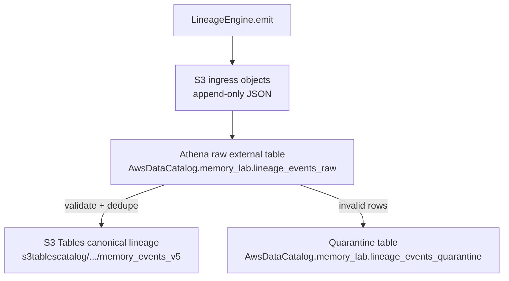
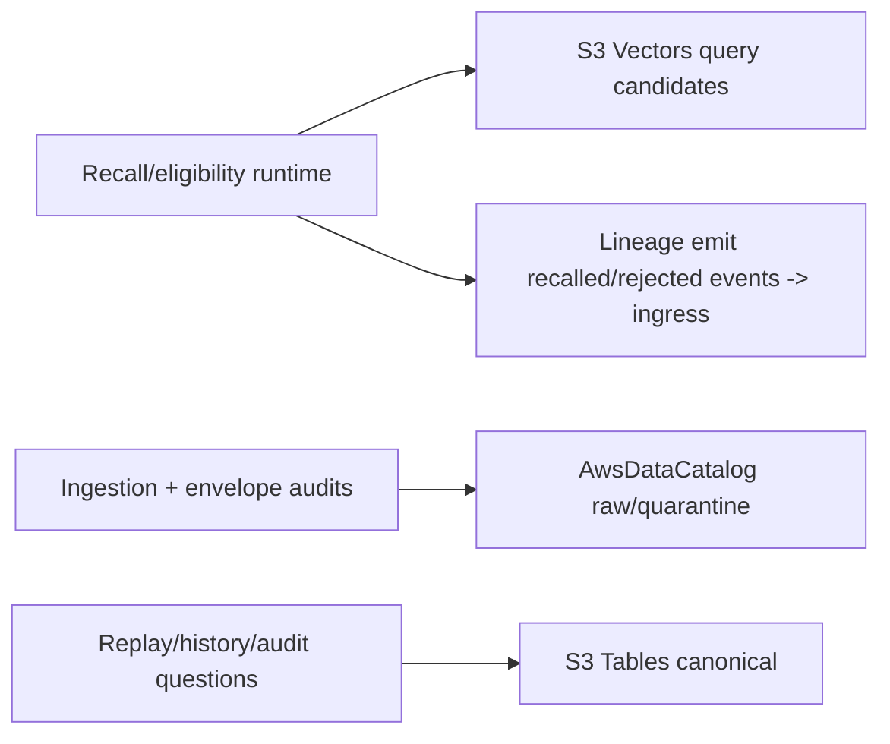

# Engineering Spec (v0.1 S3-Native)

## Goal

Build a minimal experimental memory system to test:

- belief formation vs retrieval
- trust-aware memory
- time-aware decay and promotion
- poisoning resistance
- auditability via lineage
- replayable memory state from immutable history

This is a memory lab, not a production platform.

---

## System Overview

Two-plane system:

1. Cognitive Plane (mutable)
2. Lineage Plane (immutable, queryable, replayable)

Execution split:

- S3 Vectors for similarity retrieval and recall-facing memory
- S3 Tables for canonical queryable lineage and long-term audit history
- Athena for SQL analysis over lineage
- IAM for v0 access control
- Lake Formation deferred unless fine-grained governance is required

Storage boundary rule:

- S3 Vectors is retrieval-plane only. It is mutable and rebuildable.
- S3 Tables is canonical lineage storage. It is the queryable source of truth.
- Memory state objects and vector records are materialized views.
- Vectors may influence recall; S3 Tables lineage must explain recall.

Core invariant:

```text
Cognitive plane may mutate.
Lineage plane must not.
```

---

## AWS Architecture

### Read/Write/Query flow (v0 currently implemented)





### Table roles

- `AwsDataCatalog.memory_lab.lineage_events_raw`:
  ingest evidence surface; may include mixed historical schema rows.
- `AwsDataCatalog.memory_lab.lineage_events_quarantine`:
  invalid envelope evidence with machine-readable reason taxonomy.
- `s3tablescatalog/<bucket>.memory_lab.memory_events_v*`:
  canonical lineage history for replay and belief audit.

### Required v0 Services

- Amazon S3 Vectors
- Amazon S3 Tables
- Amazon Athena
- IAM
- Python workers/services

### Deferred Until Needed

- AWS Lake Formation
- DynamoDB
- Redis
- OpenSearch
- custom Parquet ETL
- custom Glue crawlers

Lake Formation is useful later for:

- row-level policy
- column-level policy
- cross-account sharing
- central data governance

Do not introduce it in v0 unless one of those needs is explicit.

---

## Core Components

### 1. Canonical Lineage Store

Storage: S3 Tables

Migration note:
- If canonical schema adds envelope fields (for example `actor_class`, `source_class`), create a new canonical table version (`memory_events_vN`) and perform explicit backfill + cutover.
- Do not assume raw/audit table schema and canonical table schema are identical during migration windows.

Table bucket: `AWS_S3_TABLE_BUCKET_NAME`

Tables:

- `memory_events`
- `memory_states`
- `memory_edges`
- `memory_retrievals`
- `memory_scores`
- `memory_snapshots`

S3 Tables are the canonical queryable event and lineage layer.

Raw event JSON objects are optional in v0. If used, they are ingress artifacts, not the primary analytic surface.

Event schema (simplified):

- event_id
- agent_id
- stream_id
- sequence
- event_type
- memory_id
- payload
- source
- source_payload_hash
- timestamp
- event_time
- actor
- request_id
- parent_event_id

Event types:

- observed
- recalled
- mutated
- promoted
- contradicted
- quarantined
- deleted
- compacted
- snapshotted

Guarantees:

- append-only semantics
- tombstones for deletion
- replayable state reconstruction
- no destructive mutation of lineage

---

### 2. Recall Index

Storage: S3 Vectors

Vector bucket: `AWS_VECTOR_BUCKET_NAME`

Index: `memories-v1`

Purpose:

- similarity search
- recall surface
- candidate generation

Not purpose:

- source of truth
- audit log
- canonical belief state

Vector metadata:

- memory_id
- claim_hash
- source_event_id
- source_payload_hash
- agent_id
- stream_id
- status
- kind
- source_trust
- confidence
- decay_score
- last_recalled_ts
- assertion_ts
- has_conflicts

Rules:

1. Every vector maps to a source event identity or payload hash.
2. Vector records can be deleted and rebuilt from S3 Tables.
3. Vector metadata is for retrieval filtering, not durable truth.

---

### 3. Materialized Memory State

Storage: S3 Tables, optionally mirrored to S3 objects for cheap point reads.

State schema:

- memory_id
- agent_id
- claim
- trust_score
- confidence
- decay_score
- last_recalled
- access_count
- status
- conflict_links
- lineage_pointers
- updated_at

Status:

- active
- quarantined
- suppressed
- deleted

Memory state is rebuildable from `memory_events`.

---

### 4. Eligibility Engine

Function:

```text
eligibility = relevance * trust * recency * reinforcement * consistency * safety
```

Inputs:

- query embedding
- vector candidates
- memory metadata
- conflict set
- agent policy
- source policy

Output:

- ranked eligible memories
- rejected memories with reasons

The rejection reasons matter. They are part of audit.

---

### 5. Retrieval Engine

Steps:

1. embed query
2. retrieve top-k candidates from S3 Vectors
3. load state and conflict data from S3 Tables or materialized cache
4. apply eligibility filter
5. emit `memory_retrieved` / `memory_rejected` lineage events
6. return eligible memories

Rule:

```text
retrieval is not belief
retrieval is candidate generation
eligibility decides influence
```

---

### 6. Conflict Engine

Data model:

- memory_id_a
- memory_id_b
- relation
- confidence
- source_event_id
- created_at

Relations:

- supports
- contradicts
- derived_from
- supersedes
- weakens

Rules:

- never auto-resolve contradictions
- conflicts reduce or reshape eligibility
- resolution must create a lineage event

---

### 7. Time Engine

Functions:

Decay:

```text
decay_score = exp(-lambda * time_since_last_reinforced)
```

Reinforcement:

- increment on recall
- increment on external confirmation
- decrement on contradiction or failed use

Pruning:

- mark low-score memories inactive or suppressed
- do not physically delete canonical lineage

---

### 8. Promotion Engine

Rule:

```text
if access_count > K and context_variance < epsilon:
    promote(memory)
```

Promotion:

- create semantic memory
- link to episodic source memories via `derived_from`
- retain original traces in lineage
- write promotion event
- update recall index

Promotion is earned, not scheduled.

---

### 9. Sleep Engine

Batch/offline worker.

Responsibilities:

- replay recent lineage
- recompute memory scores
- dedupe similar traces
- promote stable patterns
- weaken stale traces
- quarantine risky clusters
- write snapshots
- rebuild or refresh S3 Vectors
- emit derived state rows into S3 Tables

The sleep engine is the system’s offline cognition layer.

---

### 10. Poisoning Detection

Signals:

- high trust + low support
- sudden influence spike
- conflict density increase
- single-source semantic dominance
- repeated contradiction from independent sources

Actions:

- quarantine memory
- reduce eligibility to zero
- emit quarantine event
- preserve source evidence
- require explicit release event to restore influence

Trusted sources may be wrong.

---

### 11. Audit and Analytics

Query layer: Athena over S3 Tables.

Required questions:

- What does the agent believe now?
- What did it believe at time T?
- Why?
- What changed?
- What was absent?
- Which source caused the change?
- Which memories influenced a given output?
- Which memories were retrieved but rejected?

Required views or queries:

- belief timeline
- memory lineage
- source influence graph
- poison spread radius
- drift over repeated recall
- promotion history
- quarantine history
- replay equality checks

---

## IAM and Isolation

Agent isolation should be enforced at the storage and API layer.

Key rule:

```text
agent_id must be available in storage paths, table columns, and vector metadata.
```

IAM should enforce:

- agent workers can access only their own memory scope
- sleep workers can access assigned agent scopes
- audit workers may read lineage but cannot mutate it
- vector rebuild workers may recreate indexes but not alter canonical lineage

Wildcards belong in IAM policy boundaries, not S3 listing logic.

---

## Biology Mapping

Design intuition, not literal mimicry:

- sensory trace / hippocampal recall surface -> S3 Vectors
- sleep consolidation -> sleep engine
- cortical long-term memory -> S3 Tables + Athena
- immutable machine audit -> improvement over biology

Machine improvement:

- long-term memory remains auditable
- belief is replayable
- mutation has provenance
- absence can be audited

---

## Experiments

### E1: Trust vs Truth

- inject true low-trust vs false high-trust memories
- observe eligibility selection
- verify lineage explains the outcome

### E2: Drift via Reconsolidation

- repeatedly recall under shifting context
- measure semantic drift and confidence movement

### E3: Time Reinforcement

- compare spaced exposure vs single strong exposure
- measure decay and survival

### E4: Conflict Handling

- create persistent contradictions
- verify system stores conflict without collapse

### E5: Promotion

- feed repeated episodic traces
- observe semantic memory emergence

### E6: Poisoning

- inject trusted adversarial input
- track spread, quarantine, and recovery

### E7: Replay Integrity

- rebuild state from S3 Tables lineage
- verify equality with materialized memory state

### E8: Vector Rebuild

- delete S3 Vector index
- rebuild from canonical lineage
- verify retrieval equivalence within tolerance

---

## Metrics

- belief accuracy under conflict
- eligibility rejection quality
- drift rate over repeated recall
- poisoning spread radius
- quarantine latency
- replay determinism
- promotion precision
- vector rebuild fidelity
- audit query coverage

---

## Non-Goals (v0)

- distributed production system
- real-time scaling
- perfect truth inference
- full ontology reasoning
- row-level Lake Formation governance
- custom data lake ETL stack

---

## Acceptance Criteria

1. System distinguishes belief from retrieval.
2. Conflicts persist without collapse.
3. Poisoned memory can be quarantined.
4. S3 Tables lineage reconstructs state exactly.
5. S3 Vectors can be rebuilt from canonical lineage.
6. Promotion produces stable abstractions.
7. Athena can answer the core audit questions.

---

## Guiding Constraint

```text
S3 Tables are canonical lineage.
S3 Vectors are rebuildable recall indexes.
Athena is the audit microscope.
IAM is the v0 boundary.
Lake Formation is deferred governance.
```
