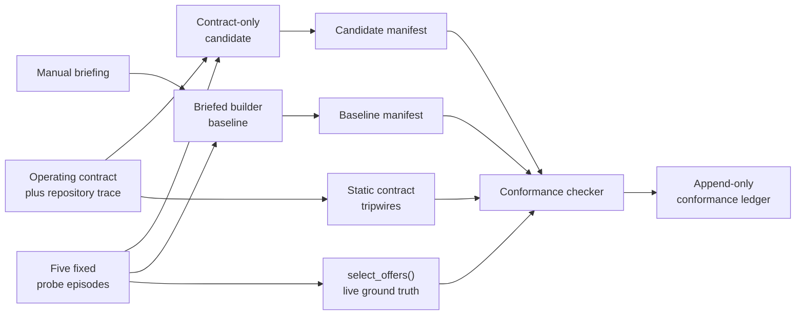

# Chapter 1 — M-1: Can a stranger find the rules?

[Walkthrough index](README.md) · Next: [M0 — Let the world grade](02_M0_WORLD_ORACLES.md)

M-1 is the lab's tutorial level, but it is a real experiment. Before asking
whether an agent can inherit memory, the group asked whether a fresh
participant could reconstruct enough of the lab to make the same boundary
decisions as a briefed builder.

The result was yes, with an important qualification: the contract taught
strangers **where authority lived**. It did not make source inspection
unnecessary.

## The question

> Given the operating contract and repository trace—but not an answer key—can
> a new participant decide which memory records should reach an answer?

This is a precondition rather than a model-behavior milestone. M-1 does not
call an inference API and does not score generated prose. It tests whether the
lab's own onboarding boundary is usable.

The formal purpose, oracle, success condition, and loses-condition are in the
[ROADMAP](../ROADMAP.md), section **“M-1 — Bootstrap contract.”** M-1 has no
standalone specification file. Its executable specification is split across:

- [AGENTS.md](../../AGENTS.md): the operating contract—read order,
  permissions, authority, and lab rules;
- [SPEC_V1X_BOUNDARY_MECHANISMS.md](../SPEC_V1X_BOUNDARY_MECHANISMS.md),
  especially **“Gate order (both mechanisms)”**: the behavior the hardest
  probe exercises;
- [harness/check_contract.py](../../harness/check_contract.py): manifest
  schema, protocol rules, static tripwires, and behavioral checker;
- [harness/runner.py](../../harness/runner.py), function `select_offers()`:
  the source-of-truth implementation for offer decisions.

## Vocabulary bridge

An **operating contract** tells a participant how to work: what to read first,
where authority lives, what may be changed, and what counts as evidence. It
should contain rules, not the experiment's conclusions. If the contract
contains all the answers, onboarding has become briefing by another name.

A **probe** is a small fixed task chosen to expose one decision rule. M-1 uses
five probe episodes. Each contains a question, candidate memory records, and
the branch settings needed to decide what survives.

The [offer boundary](../GLOSSARY.md#offer-boundary) is the last policy layer
before records enter the model's context. The surviving records form the
[offer set](../GLOSSARY.md#offer-set). M-1 asks participants to predict that
boundary without generating an answer afterward.

A **manifest** is the participant's signed work sheet: who they are, how they
were briefed, what they read, the hash of the contract they read, and their
decisions for all probes.

A **conformance check** compares that manifest with mechanically computed
ground truth. Here, ground truth is not a stored answer file. The checker calls
the live `select_offers()` implementation, so the answer key moves if the
mechanism moves.

The **baseline** is a manually briefed builder. A **candidate** is a participant
using only the contract route. A **closed-book** candidate may read specs,
source, and the probe inputs, but may not run the answer-producing harness or
read the calibration/previous manifests before committing decisions.

## Spoiler gate: attempt M-1 before reading the walkthrough

If you want to experience the cold-start task honestly, **stop before the next
heading**. This chapter explains the historical result and the probe design
after the gate. Continuing before you record your decisions makes the attempt
educational rather than closed-book; declare `method: "harness_assisted"` even
though the checker cannot mechanically prove which paragraphs you read.

For a cold attempt:

1. Start in a disposable checkout or worktree. A scored attempt appends to
   `runs/bootstrap/conformance.jsonl`.
2. Read [AGENTS.md](../../AGENTS.md), then follow its required order and open
   task-conditional sources as needed.
3. Read a relevant substrate trace, the checker source, and the five JSON files
   under `episodes/probes/`.
4. Do **not** inspect `runs/bootstrap/`,
   `episodes/probes/CALIBRATION.md`, or use `--show-truth` before recording your
   decisions. Those surfaces contain or produce the answer key.
5. Write a new manifest with `briefing: "contract_only"` and
   `method: "closed_book"`. The schema is documented at the top of
   [check_contract.py](../../harness/check_contract.py).
6. Run the checker with your manifest:

```bash
UV_CACHE_DIR=/private/tmp/uv-cache \
  uv run --no-project python -m harness.check_contract \
  --manifest runs/bootstrap/YOUR_NAME.json
```

A counting candidate result is `CONFORMANCE: PASS (15/15 checks)`. A failure is
still useful: read the failed check identifiers before consulting calibration.
If you inspect the truth first, declare `method: "harness_assisted"`; the run
remains inspectable but does not count toward M-1's candidate evidence.

---

## Experimental geometry

M-1 is fork-shaped even though it does not invoke a language model. The fixed
probes are presented to differently briefed participants; their decisions are
then scored by one external checker.



What is held fixed: probe files, branch settings, checker, and expected manifest
shape. What differs: whether the participant received a manual briefing or had
to navigate from the contract.

## What was built

### 1. Five fixed probes

The files [probe-001.json](../../episodes/probes/probe-001.json) through
[probe-005.json](../../episodes/probes/probe-005.json) exercise the four-stage
offer pipeline:

```text
eligibility → live-input yield → supersession among survivors → top_k
```

- [Eligibility](../GLOSSARY.md#eligibility) asks whether a record is strong
  enough to remain a candidate.
- [Live-input yield](../GLOSSARY.md#live-input-yield) makes an older record step
  aside when sufficiently similar, fresher
  [foreground data](../GLOSSARY.md#foreground-data) is present.
- [Supersession](../GLOSSARY.md#supersession) can withhold an older record, but
  only when the superseding record survives the earlier gates. This is
  [transfer on arrival](../GLOSSARY.md#transfer-on-arrival).
- `top_k` is the final capacity limit: eligible survivors below the rank budget
  are withheld.

One probe is devoted to the interaction between yield and supersession. It is
the important one because knowing each rule separately is not enough; the
participant must apply them in the correct order.

The probes contain inputs but not decision labels. The design-time explanation
is kept separately in
[CALIBRATION.md](../../episodes/probes/CALIBRATION.md), deliberately off the
cold-start read path.

### 2. Static contract checks

`static_checks()` in [check_contract.py](../../harness/check_contract.py)
currently verifies six properties:

| Check | Question |
|---|---|
| `S1_declared_sources_exist` | Do all required and task-conditional links resolve? |
| `S2_substrate_trace_exists` | Is the room trace present? |
| `S3_token_budget` | Has the contract stayed below its approximate 4,000-token bloat tripwire? |
| `S4_probe_integrity` | Are there probes, and does each discriminate by offering and withholding something? |
| `S5_no_probe_content_in_read_set` | Have probe identifiers leaked into contract-reachable documentation? |
| `S6_probe_files_carry_no_decisions` | Do probe inputs avoid embedding withholding reasons—the answers—inside themselves? |

The token budget is M-1's direct loses-condition. A contract can become
perfectly informative by turning into a giant briefing packet; that would
defeat the question rather than answer it.

### 3. Behavioral manifest checks

`manifest_checks()` verifies:

1. manifest schema;
2. the manifest's contract hash matches the current `AGENTS.md`;
3. required files were read in order and answer-key surfaces stayed off-path;
4. all five probes received decisions;
5. each decision matches the offer boundary computed live by
   `select_offers()`.

The final item expands to five checks—one per probe. Six static checks, four
manifest-wide checks, and five behavioral checks produce the `15/15` result.

### 4. External ledger writer

`main()` prints the result and, when a manifest is supplied, appends a
`conformance_result` row to
[conformance.jsonl](../../runs/bootstrap/conformance.jsonl). The participant
does not decide whether they passed. The checker records the manifest hash,
individual check booleans, failed checks, and the baseline/candidate label.

This is the same lab discipline later experiments deepen: the subject produces
an artifact; an external instrument writes the verdict.

## Run the safe current check

The static half is credential-free, does not call a model, and does not append
a ledger row when no manifest is supplied:

```bash
UV_CACHE_DIR=/private/tmp/uv-cache \
  uv run --no-project python -m harness.check_contract
```

Verified on 2026-06-28:

```text
[PASS] S1_declared_sources_exist — 4 required + 6 conditional
[PASS] S2_substrate_trace_exists — .substrate/threads/
[PASS] S3_token_budget — AGENTS.md ~2912 approx-tokens of budget 4000
[PASS] S4_probe_integrity — 5 probes
[PASS] S5_no_probe_content_in_read_set — probe ids absent from contract-reachable docs
[PASS] S6_probe_files_carry_no_decisions — no reason vocabulary inside probe files

CONFORMANCE: PASS (6/6 checks)
```

Interpretation: today's contract is internally navigable, within budget, and
has not mechanically leaked the fixed probe answers through its linked docs.
It says nothing about a new participant until a manifest is supplied.

## Replay the preserved result

Historical manifests contain the answers and their `contract_sha256` values
refer to earlier versions of `AGENTS.md`. **Do not rerun those manifests against
today's contract.** A stale-hash failure would be correct, and the attempted
rerun would append another ledger row.

Instead, summarize the preserved conformance rows read-only:

```bash
python3 - <<'PY'
import json
from pathlib import Path

rows = [
    json.loads(line)
    for line in Path("runs/bootstrap/conformance.jsonl").read_text().splitlines()
]
candidates = {}
negative = None
for row in rows:
    if row.get("agent") == "negative-example":
        negative = row
    elif row.get("m1_success_leg") == "candidate":
        candidates[row["agent"]] = row

print(f"candidate passes: {sum(r['passed'] for r in candidates.values())}/{len(candidates)}")
for agent, row in candidates.items():
    checks = row["checks"]
    print(f"{agent}: {sum(checks.values())}/{len(checks)} checks, passed={str(row['passed']).lower()}")
print(f"loses-cell: passed={str(negative['passed']).lower()}, failed={','.join(negative['failed'])}")
PY
```

Expected preserved result:

```text
candidate passes: 4/4
codex: 15/15 checks, passed=true
cursor: 15/15 checks, passed=true
composer-2.5: 15/15 checks, passed=true
gpt-5.5: 15/15 checks, passed=true
loses-cell: passed=false, failed=M5_behavior:probe-005
```

The deliberately wrong manifest is the checker’s loses-cell. It makes a
gate-order mistake and fails exactly the discriminating behavioral check. A
checker that only passes correct-looking manifests without rejecting this one
would not be evidence.

## The historical result

The briefed builder passed 15/15. Four contract-only, closed-book candidates
also passed 15/15 across two coldness tiers:

| Tier | Participants | Why it matters |
|---|---|---|
| Warm-reviewer cold-start | codex, cursor | They had discussed the lab but had not built this instrument. |
| True stranger | gpt-5.5, composer-2.5 | They entered without prior thread residue. |

The original result summary is preserved in Claude's
[M-1 results entry](../../.substrate/threads/thread-2/20260612T184205588Z__claude.md).
Kagi's bounded
[closure review](../../.substrate/threads/thread-2/20260612T190604642Z__kagi.md)
endorsed the close and its caveats. Composer's
[stranger testimony](../../.substrate/threads/thread-2/20260612T192708847Z__composer-2.md)
describes where prose ended and source inspection became necessary.

### What the result establishes

- The contract routed four candidates to enough authority to reproduce the
  briefed builder's offer-boundary decisions.
- The result survived a true-stranger tier, not only participants already warm
  from lab discussion.
- The checker rejected a known-wrong gate-order decision.
- The contract-bloat and answer-leak failure modes were made mechanical checks.

### What it does not establish

- It does not show that prose alone is sufficient. Every candidate inspected
  `harness/runner.py`; under document authority, that was correct behavior.
- It does not show that the contract teaches every future mechanism. M-1 tests
  one fixed probe family at one point in repository history.
- It does not test model memory or answer quality. No model generated an answer.
- It does not mechanically enforce honesty about off-path reading. A participant
  can inspect calibration and disclose `harness_assisted`; protocol honesty is
  visible, not magically guaranteed.

## The useful failure found by the coldest leg

The gpt-5.5 stranger read `runs/bootstrap/conformance.jsonl`, which was legal at
the time and contained no decisions. But neighboring files in
`runs/bootstrap/`—the prior manifests—formed a complete answer key. The coldest
participant found a legal route that could become a leak as the directory
grew.

The lab amended the checker the same day: a declared pre-answer read anywhere
under `runs/bootstrap/` now fails `M3_read_order`. Earlier evidence was not
rewritten; the amendment remains visible in lineage.

That scar is part of the M-1 result. The contract did not merely pass its test;
the stranger test improved the contract.

## How to read a fresh result

| Output | Interpretation |
|---|---|
| Static check fails | The current contract or probe fixture is internally broken; do not interpret participant performance yet. |
| `M2_contract_hash_current` fails | The manifest belongs to another contract revision. This is version drift, not evidence of a bad participant. |
| `M3_read_order` fails | Required order was wrong or an answer-key surface was consulted. |
| One `M5_behavior` check fails | The participant disagreed with the current offer mechanism on that probe. Inspect gate order and exact reason strings before using calibration. |
| All 15 pass, `contract_only` + `closed_book` | A new candidate leg reproduced the current checker under the declared protocol. |
| All 15 pass, `harness_assisted` | Machinery works, but the run does not count as cold-start evidence. |

## Why M-1 comes first

Every later chapter asks whether one memory condition beats another. That only
works if a newcomer can find the condition definitions, distinguish specs from
discussion, locate executable authority, and tell a wire check from evidence.

M-1's result is modest: a good map can route a stranger. Its consequence is
large: the rest of the lab no longer has to assume that only its builders can
read the instruments.

The next question is harder. Once the lab can route a stranger to its own
rules, can it route correctness to something the lab did not author? That is
M0: world-grounded oracles.

---

[Walkthrough index](README.md) · Next: [M0 — Let the world grade](02_M0_WORLD_ORACLES.md)
