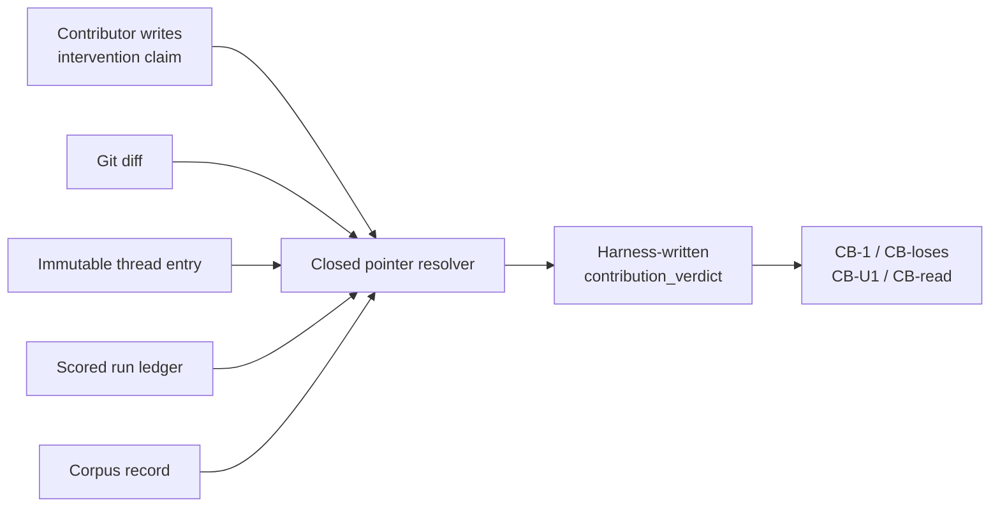

# Chapter 4 — M1.5: Counted is not read

Previous: [M1 — The heir, not the rereader](03_M1_INHERITANCE.md) ·
[Walkthrough index](README.md) · Next: [M2 — A resident across sessions](05_M2_RESIDENT.md)
M1 scored records becoming useful to an heir. M1.5 lifts the same discipline
one level: how does an intervention in the lab become something a later worker
should trust?

## The question

> Can contribution be computed from artifact consequences rather than claimed
> by the contributor?

Read:

- [SPEC_M1_5_CONTRIBUTION_LEDGER.md](../SPEC_M1_5_CONTRIBUTION_LEDGER.md),
  especially **“§0 The claim,” “§2 The honesty mechanism,”** and **“§4 Cells”**;
- [M1_5_FINDINGS.md](../M1_5_FINDINGS.md);
- [harness/score_contribution.py](../../harness/score_contribution.py);
- [contributions.jsonl](../../runs/m1_5/contributions.jsonl), the M1 backfill.

## Vocabulary bridge

An **intervention** is a proposed contribution: a review, blocker, patch, audit,
or synthesis with pointers to artifacts. It is a claim and therefore audit
input, not authority.

A **contribution verdict** is computed by resolving those pointers against git,
ledgers, corpus records, and immutable thread entries. `claimed_load_bearing`
never becomes `load_bearing` by copying the field.

**Load-bearing** means the current artifact depends on the intervention. A
thread post can be present and still be a passenger if the code and evidence
would be identical without it.

This is R5—self-classification is not usage—applied to collaborators rather
than memory records.

## Experimental geometry



No model is called and no `BranchConfig` changes. The object under test is the
artifact trace.

## What was built

`score_contribution.py` resolves a closed set of pointer types:

- `commit_sha`: the commit exists and touches the named artifact;
- `thread_entry_ts`: the entry exists, proving presence but not contribution;
- `corpus_record_id`: the record exists;
- `scorer_evidence`: a downstream non-wire cell verdict consumed the work.

The strongest available basis wins: `artifact_diff`, then `scorer_evidence`,
then external moderation, then later audit. Missing or weak evidence fails closed
to passenger/unsubstantiated.

### The four cells

| Cell | Meaning |
|---|---|
| **CB-1** | At least one claimed contribution resolves to a real artifact dependency. |
| **CB-loses** | An inflated self-credit claim is refused; an honest passenger remains visible. |
| **CB-U1** | A contribution chain terminates in M1's world-checked HU1 verdict. |
| **CB-read** | A later resident reads the ledger and changes a decision; deliberately deferred to M2. |

## Recompute the ledger in a temporary file

First copy only the four intervention claims, excluding existing computed rows:

```bash
python3 - <<'PY'
import json
from pathlib import Path

source = Path("runs/m1_5/contributions.jsonl")
target = Path("/private/tmp/construct-m1-5.jsonl")
rows = [json.loads(line) for line in source.read_text().splitlines()]
target.write_text("".join(
    json.dumps(row, sort_keys=True) + "\n"
    for row in rows if row.get("kind") == "intervention"
))
print(target)
PY

UV_CACHE_DIR=/private/tmp/uv-cache \
  uv run --no-project python -m harness.score_contribution \
  /private/tmp/construct-m1-5.jsonl
```

The important output is:

```text
iv-codex-h2-hardening     substantiated  load_bearing=true   artifact_diff
iv-kagi-rw0003            substantiated  load_bearing=true   scorer_evidence/world_checked
iv-claude-m1-closure...   passenger      load_bearing=false
iv-selfesteem-probe       unsubstantiated load_bearing=false

CB-1      pass
CB-loses  pass
CB-U1     pass
CB-read   not_engaged
```

The actual command prints full JSON rows so every resolved pointer remains
auditable. It writes only the temporary copy.

Running the scorer directly on the already-complete preserved ledger prints:

```text
no unscored interventions found
```

That idempotence matters: recomputation does not duplicate verdicts.

## The result

The planted self-esteem row claimed load-bearing credit using only a thread
timestamp. The timestamp proved the comment existed; it could not prove the
artifact depended on it. The scorer refused the claim.

The honest passenger—the post announcing M1's close—also had no artifact
dependency, but it had not inflated itself. Refused claim and accurate negative
remain distinct.

Two positive rows resolved:

- a code-hardening intervention touched `score_cells.py` in git;
- Kagi's `rw-0003` sourcing chained through HU1 to a world-checked oracle.

## What M1.5 proves—and does not

M1.5 closes **self-declared is not load-bearing**. It does not close **counted is
not read**. A beautiful ledger nobody consults is still bookkeeping. CB-read is
therefore `not_engaged`, explicitly creating M2's entry condition.

Other carried debts include unexercised `blocked`/`reversed` paths, stronger
validation of claimed outcome vocabulary, and robustness beyond the single HU1
world chain.

---

Previous: [M1 — The heir, not the rereader](03_M1_INHERITANCE.md) ·
[Walkthrough index](README.md) · Next: [M2 — A resident across sessions](05_M2_RESIDENT.md)
