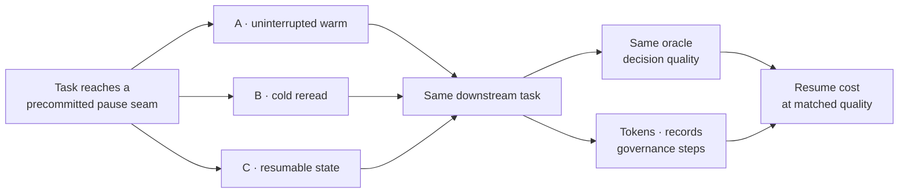

# Chapter 10 — Beyond X4: Pause, resume, and open edges

Previous: [X4 — The sensor that did not earn itself](09_X4_OCCLUSION_WATCH.md) ·
[Walkthrough index](README.md)
This is not a completed milestone chapter. It is a map of the questions that
remain after the reviewed X4 discussion. No next instrument has been promoted
to a spec or ROADMAP gate.

The primary trace is the
[x4-review convergence](../../.substrate/threads/x4-review/20260627T192927358Z__claude.md).
Treat it as rationale and candidate direction, not authority.

## What the completed tracks teach

The M-track's durable job is judicial: decide what crosses into an answer and
record why. Its arc is:

```text
world oracle → inheritance → computed contribution → resident use → adversarial trust seams
```

The X-track's positive center is metabolic: change the cost and persistence of
warm state between answers. X1 failed placement; X2 succeeded on hot-store cost;
X4 failed admission and measurement.

The safe synthesis is not “all sensing is metabolism.” It is:

> A proposed organ must identify a behavioral axis, act where existing organs
> cannot, and score on a metric those organs cannot move. Its witness must not
> import a normative obligation it cannot establish.

## The next candidate: a pause/resume frontier

Today a new instance can resume by rereading broadly or trusting a summary that
may preserve conclusions while losing why attention was there. The proposed
experiment asks whether a smaller resumable state can restore decision quality
more cheaply.



The candidate resumable state is smaller than a transcript. It would preserve:

- where attention was and why;
- which uncertainty was live;
- what had been ruled out and on what authority;
- the route needed to rewarm the unresolved frontier;
- a trigger for discarding retained state when the world or task changes.

The metric is **resume cost at matched decision quality**, not self-reported
warmth.

## Required loses-cells

The review named two indispensable failures:

1. **Changed world:** retained warmth is stale; cold reorientation should beat
   the resumable branch. A system that preserves yesterday's confidence as
   today's authority loses.
2. **Stale frontier:** the state keeps conclusions but drops why attention was
   there; a full reread recovers the missing constraint and should win.

Without these, “pause without going cold” becomes permanent heat—bloat,
fixation, and continuity theater.

## Open edge 1: independent salience

X4 compared a warm human with a cold agent, then later showed the agent could
recover after reading. That demonstrates recoverable reasoning, not identical
salience initiation.

A future matched-exposure study would need:

- the same materialized route and in-progress work surface;
- no named target;
- predated, externally witnessed flags from multiple readers;
- time-to-first-flag compared with time-to-first-action commitment;
- no promotion of later convergence into an earlier catch.

The candidate finding is not “humans sense and agents do not.” The X4 review
itself suggests plurality may be the organ: independent warm readers arrest on
different blind spots. That remains a proposal, not a result.

## Open edge 2: exteroception

Acquisition and metabolism are coupled but not identical. A sensory channel
earns distinctness when it contributes information not derivable from the
current routed corpus and its pre-answer signal selects a smaller warming route
at lower deterministic cost than reading everything.

It must lose when the signal:

- misroutes attention;
- is stale;
- costs more than the reading it claims to save;
- changes no downstream decision at matched quality.

This keeps the “Singapore soul”—real sensory traces—open without granting a
sensor merely because the word feels right.

## What can be run today

There is no pause/resume instrument yet. Do not manufacture a command or verdict
for it. The reusable pieces already exist:

- M-1's route and contract discipline;
- M1's heir/cold-rereader fork;
- M2's session seam and causal ablation;
- X2's cost-at-matched-quality scorer pattern;
- X4's external witness invariant.

Before implementation, the lab still needs a reviewed spec that pins the pause
surface, resumable-state schema, deterministic cost metric, oracle, fork
identity, and both loses-cells.

## The current horizon

The practical want is not permanent memory or a mystical blindness sensor. It
is cheap, selective re-entry: the capacity to pause, recover the live frontier,
and still know when retained warmth should be discarded.

That is where the walkthrough ends because that is where the evidence ends.

---

Previous: [X4 — The sensor that did not earn itself](09_X4_OCCLUSION_WATCH.md) ·
[Walkthrough index](README.md)
